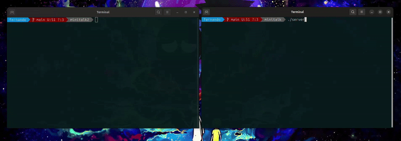

# **Minitalk** 📡  
### *42 Project - UNIX Signal Communication*  

  
*A simple client-server message exchange using **UNIX signals***  

---

## **📌 Overview**  
**Minitalk** is a 42 project that demonstrates **inter-process communication (IPC)** using **UNIX signals** (`SIGUSR1` and `SIGUSR2`). The project consists of:  
- A **server** that listens for incoming signals.  
- A **client** that sends messages (strings) to the server via signals.  

The challenge? **Transmitting data bit-by-bit using only signals!**  

---

## **🚀 Features**  
✔ **Basic Requirements**  
- Server prints its **PID** on startup.  
- Client sends a string to the server using signals.  
- Server receives and reconstructs the message.  

✔ **Bonus Extras**  
✅ **Unicode Support** (UTF-8 characters)  
✅ **Acknowledgement System** (Server confirms each received byte)  
✅ **Optimized Signal Handling** (Minimal delay, no lag)  
✅ **Defensive Programming** (Handles invalid PIDs, NULL messages, etc.)  

---

## **🛠️ Installation & Usage**  
### **1. Compile**  
```bash  
make        # Compiles both server & client
```  

### **2. Run**  
#### **In Terminal 1 (Server)**  
```bash  
./server  
```  
The server will display its PID.  

#### **In Terminal 2 (Client)**  
```bash  
./client [SERVER_PID] "Hello, World!"  
```  
- The client sends the message to the server.  
- The server prints the received message.  

*(Bonus: Try sending emojis! 🚀🔥)*  

---

## **📡 How It Works**  
### **Signal-Based Transmission**  
- Each **bit** (`0` or `1`) is sent as:  
  - `SIGUSR1` = `0`  
  - `SIGUSR2` = `1`  
- The server reconstructs the message **byte-by-byte** from the bits.  

### **Flow**  
1. **Client** splits the message into bits.  
2. **Server** receives each bit and rebuilds the original string.  
3. **(Bonus)** Server sends an **ACK signal** after each byte.   

---

## **⚡ Performance & Optimizations**  
- **Fast Transmission:** Minimal sleep times between signals.  
- **No Memory Leaks:** Clean signal handling with `sigaction()`.  
- **Supports Long Messages:** Dynamically processes strings of any length.  

---

## **📜 Example Output**  
### **Terminal 1 (Server)**  
```  
$ ./server  
Server PID: 12345  
Waiting for messages...  
Received: "Hello, World!"  
Received: "你好！👋"  
```  

### **Terminal 2 (Client)**  
```  
$ ./client 12345 "Hello, World!"  
Message sent successfully!  
$ ./client 12345 "你好！👋"  
Message sent successfully!  
```   

---

## **📝 Credits**  
**Completed at:** 42 Malaga  
**Author:** Fernando (@fosuna-g)  
**Date:** 2024-10-15  

<p align="center">
    
</p>

---  

### **🚀 Ready to Try?**  
```bash  
make && ./server  
# (In another terminal)  
./client [PID] "42 rocks!"  
```  

*(Bonus: Try sending a secret message in binary!)*  
